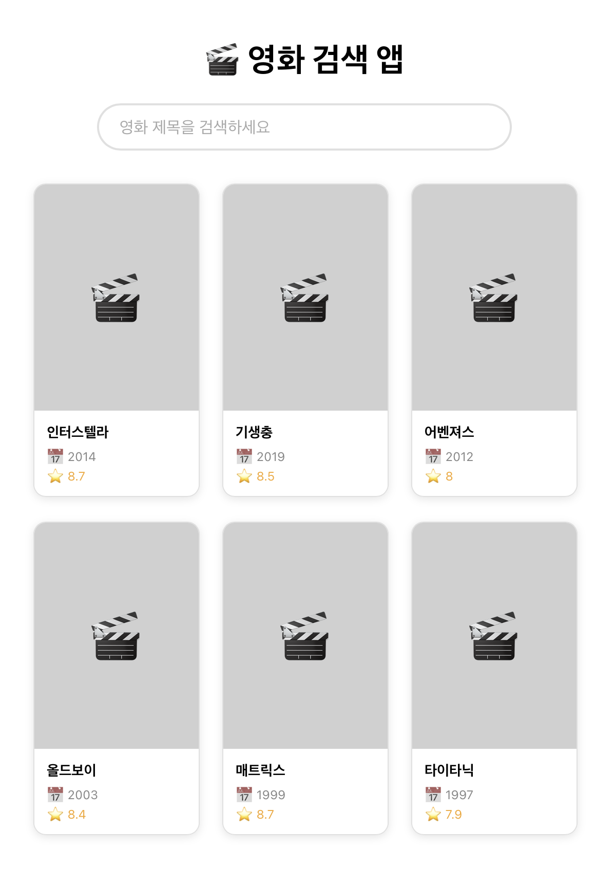

# 🎬 영화 검색 앱

TMDB API를 활용한 영화 검색 서비스입니다.

## 배포 링크
🔗 [배포 링크] (추후 Vercel 배포 후 추가)

## 스크린샷
- 1주차


## 기술 스택
- React
- Next.js
- TMDB API
- Vercel (배포)

## 주요 기능
- 영화 제목으로 실시간 검색
- 영화 상세 정보 조회
- 찜하기 기능
- 서버사이드 렌더링(SSR) 적용

## 실행 방법
\```bash
git clone https://github.com/dksgyrud1349/movie-app.git
cd movie-app
npm install
npm start
\```

## 구현하면서 배운 것
- React의 useState, useEffect를 활용한 상태 관리
- Next.js SSR과 CSR의 차이점 및 적용 방법
- TMDB API 연동 및 비동기 데이터 처리